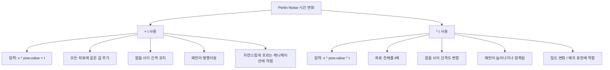
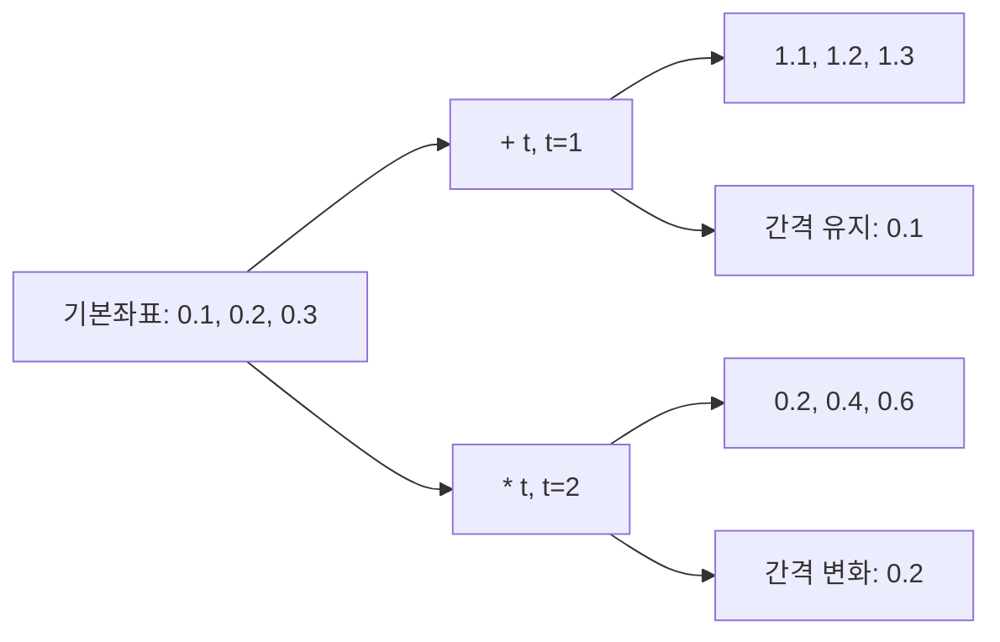
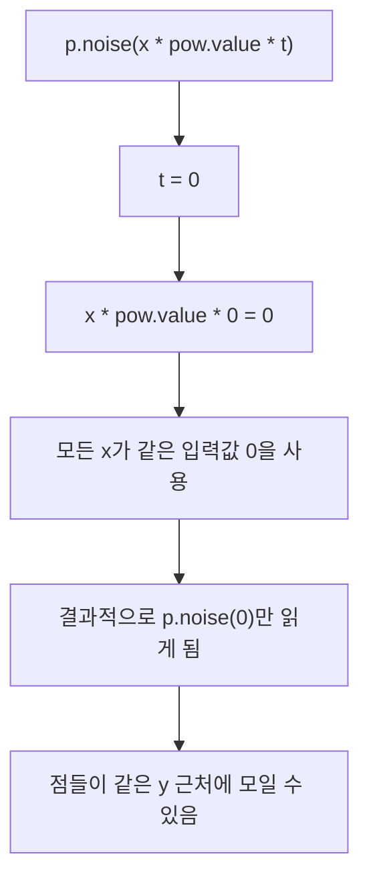

# Perlin Noise에서 `* t`와 `+ t`의 차이

기준 코드:

```js
let y = p.noise(x * pow.value * t) * CANVAS_SIZE;
```

여기서 핵심은 `t`를 **곱하느냐(`* t`)**, 아니면 **더하느냐(`+ t`)**에 따라  
시간에 따른 노이즈 변화 방식이 완전히 달라진다는 점이다.

---

## 1. `* t`의 의미

예:

```js
p.noise(x * pow.value * t)
```

이 식은 사실 이렇게 해석할 수 있다:

```js
p.noise((x * pow.value) * t)
```

즉, 원래 노이즈 입력값이던 `x * pow.value` 전체를 `t`배 하는 것이다.

### 직관
- 시간 `t`가 커질수록 노이즈를 읽는 좌표가 커진다.
- 단순히 패턴이 옆으로 이동하는 것이 아니다.
- **좌표 간격 자체가 함께 늘어난다.**
- 그래서 패턴이 흐르는 느낌보다는 **늘어나거나 압축되는 느낌**, 또는 **샘플링 밀도가 변하는 느낌**이 난다.

---

## 2. 숫자로 보는 `* t`

다음 값을 가정해보자.

- `x = 10`
- `pow.value = 0.01`

그러면 기본 좌표는:

```txt
x * pow.value = 10 * 0.01 = 0.1
```

이제 여기에 `t`를 곱하면:

```txt
0.1 * t
```

### 예시
- `t = 0` → `0.1 * 0 = 0`
- `t = 1` → `0.1 * 1 = 0.1`
- `t = 2` → `0.1 * 2 = 0.2`
- `t = 10` → `0.1 * 10 = 1.0`

즉 시간에 따라 입력값이 다음처럼 바뀐다:

```txt
p.noise(0)
p.noise(0.1)
p.noise(0.2)
p.noise(1.0)
```

---

## 3. 여러 점을 같이 보면 더 명확하다

`pow.value = 0.01`로 고정하고:

- `x = 10` → 기본좌표 `0.1`
- `x = 20` → 기본좌표 `0.2`
- `x = 30` → 기본좌표 `0.3`

라고 해보자.

### `t = 1`
- `10 → 0.1`
- `20 → 0.2`
- `30 → 0.3`

### `t = 2`
- `10 → 0.2`
- `20 → 0.4`
- `30 → 0.6`

### `t = 3`
- `10 → 0.3`
- `20 → 0.6`
- `30 → 0.9`

여기서 중요한 점은,  
각 점이 단순히 같은 거리만큼 이동하는 것이 아니라 **간격도 함께 커진다**는 것이다.

예를 들어:

- `t = 1`일 때 간격: `0.1`
- `t = 2`일 때 간격: `0.2`
- `t = 3`일 때 간격: `0.3`

즉 `* t`는 시간에 따라 **샘플링 포인트들 사이 거리 자체를 바꾸는 방식**이다.

---

## 4. `+ t`는 어떻게 다른가

예:

```js
p.noise(x * pow.value + t)
```

이 경우에는 시간 `t`를 좌표에 **더해서 이동**시킨다.

같은 기본좌표 `0.1, 0.2, 0.3`에 대해:

### `t = 1`
- `0.1 + 1 = 1.1`
- `0.2 + 1 = 1.2`
- `0.3 + 1 = 1.3`

### `t = 2`
- `0.1 + 2 = 2.1`
- `0.2 + 2 = 2.2`
- `0.3 + 2 = 2.3`

여기서는 점들 사이 간격이 계속 같다.

- 원래 간격: `0.1`
- `+ t` 후에도 간격: `0.1`

즉 패턴 전체가 **그대로 옆으로 미끄러지는 느낌**이다.

---

## 5. `* t`와 `+ t`의 핵심 차이

### `+ t`
- 모든 좌표에 같은 값을 더한다.
- 점들 사이의 간격은 유지된다.
- 패턴이 **평행이동**하는 느낌이다.
- 보통 시간에 따라 노이즈를 자연스럽게 흐르게 만들 때 자주 사용한다.

### `* t`
- 모든 좌표를 같은 비율로 곱한다.
- 점들 사이의 간격도 바뀐다.
- 패턴이 이동한다기보다 **늘어나거나 압축되는 느낌**이 생긴다.
- 시간에 따라 샘플링 밀도나 구조가 달라지는 효과를 만든다.

---

## 6. 아주 짧은 비유

기본 좌표가 다음과 같다고 하자.

- A = 1
- B = 2
- C = 3

### `+ 10`
- 11, 12, 13

→ 모두 같은 거리만큼 이동  
→ 간격 유지

### `* 10`
- 10, 20, 30

→ 원점 기준으로 멀어짐  
→ 간격도 함께 커짐

이 비유로 보면 `* t`는 “시간을 더하는 것”이 아니라  
**좌표계를 배율로 늘리는 것**에 가깝다.

---

## 7. 현재 코드에서 특히 중요한 점

현재 코드:

```js
let y = p.noise(x * pow.value * t) * CANVAS_SIZE;
```

여기서 `t = 0`이면:

```js
x * pow.value * 0 = 0
```

즉 모든 `x`에 대해 입력값이 `0`이 된다.

결과적으로:

```js
p.noise(0)
```

만 계속 읽게 되므로,  
모든 점이 거의 같은 `y`값을 가질 수 있다.

그래서 애니메이션 초반에 점들이 한 줄처럼 겹쳐 보일 수도 있다.

---

## 8. 언제 무엇을 쓰면 좋은가

### `+ t`가 어울리는 경우
- 노이즈가 시간에 따라 자연스럽게 흐르길 원할 때
- 물결, 바람, 구름 같은 부드러운 애니메이션을 만들 때
- 패턴의 형태는 유지한 채 시간 변화만 주고 싶을 때

예:

```js
let y = p.noise(x * pow.value + t) * CANVAS_SIZE;
```

### `* t`가 어울리는 경우
- 시간에 따라 패턴 밀도나 구조가 변형되길 원할 때
- 확대/축소 또는 왜곡 같은 느낌을 주고 싶을 때
- 단순한 흐름이 아니라 샘플링 방식 자체가 변하길 원할 때

예:

```js
let y = p.noise(x * pow.value * t) * CANVAS_SIZE;
```

---

## 9. 한 줄 정리

- `+ t` → **패턴을 이동시킨다**
- `* t` → **패턴을 읽는 좌표의 스케일을 바꾼다**

그래서 보통 “시간에 따라 자연스럽게 움직이는 퍼린 노이즈”를 원하면  
`+ t`가 더 직관적이고 자주 쓰인다.

---

## 10. Obsidian용 Mermaid 다이어그램

아래 코드는 Obsidian에 그대로 붙여넣으면, `+ t`와 `* t`의 차이를 시각적으로 정리해서 볼 수 있다.

### 10-1. 개념 비교 다이어그램



### 10-2. 숫자 예시 다이어그램



### 10-3. `t = 0`일 때의 차이



---

## 11. Obsidian에서 어떻게 쓰면 좋은가

- 설명 본문 아래에 Mermaid 블록을 넣으면 된다.
- 미리보기 모드에서 다이어그램으로 렌더링된다.
- 이해를 위해 `개념 비교 다이어그램` + `t = 0 다이어그램` 조합이 특히 유용하다.
- 나중에 노트 링크를 추가해서 `[[Perlin Noise]]`, `[[p5.js]]`, `[[noise()]]` 같은 식으로 연결하면 Graph View에서도 함께 관리할 수 있다.

---

## 12. 추천 사용 방식

이 노트에서는 아래 순서가 가장 보기 좋다.

1. 글 설명 읽기  
2. 숫자 예시 확인  
3. Mermaid 다이어그램으로 구조 다시 보기  
4. 실제 코드와 연결해서 이해하기

즉, 글로 이해하고 다이어그램으로 다시 압축해서 보는 방식이다.